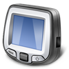

#  GPS Framework for .NET

[Screen Shots](Docs/ScreenShots.md) | [GPS Diagnostics](Docs/GPSDiagnostics.md)

This framework delivers intuitive real-time GPS functionality with maximum ~~laziness~~ efficiency for all possible computers, mobile devices and NMEA-compliant GPS devices.

## Related Projects:
- [DotSpatial](https://github.com/DotSpatial/DotSpatial)
- [GeoFramework 2.0](https://github.com/BigstickCarpet/GeoFramework)
- [GeoFramework 1.0](http://geoframework1.codeplex.com)

## Features

* Automatic detection of serial GPS devices (or devices found via a virtual serial port).
* Automatic detection of Bluetooth devices (when using the Microsoft Bluetooth stack.)
* Support for newer devices using the QualComm GPS chipset (namely, HTC devices such as the TyTn II, P3300 and AT&T Tilt)
* Automatic baud rate detection.
* Automatic recovery of lost connections.
* A single code base which supports .NET Framework 2.0/3.x and .NET Compact Framework 2.0/3.x.
* Advanced GPS precision via Kalman filtering.
* Support for desktops and mobile devices.
* Support for the GPS Intermediate Driver on Windows Mobile 5.0+
* Support for real-time GPS data without relying on Microsoft's GPS API.
* Support for control and monitoring of precision.
* A set of animated gauge controls for desktops and mobile devices (Altimeter, Compass, Speedometer, SatelliteViewer, SatelliteSignalBar).

## Supported Frameworks

This library supports all .NET Frameworks from version 2.0 through 4.0 as well as .NET Compact Framework versions 2.0, and 3.5.  Compiler directives are used to target source code for a particular platform (as opposed to having multiple code bases.)

## Project History

#### GPS.Net 1.0 and 2.0

GPS.NET is a formerly commercial .NET component maintained by GeoFrameworks, LLC from 2004 to 2009.  In 2009, [Jon Person](http://www.codeplex.com/site/users/view/jperson) decided to release the full source code of GPS.NET to the public domain for the benefit of the open source development community.  

#### GPS.Net 3.0

This version is the latest release which had a short lifespan before being released on CodePlex.  The purpose of this framework is to deliver intuitive real-time GPS functionality with maximum ~~laziness~~ efficiency for all possible computers, mobile devices and NMEA-compliant GPS devices.

#### GPS.Net is now DotSpatial

[GeoFramework](https://github.com/BigstickCarpet/GeoFramework) and GPS.Net are now part of the larger [DotSpatial](https://github.com/DotSpatial/DotSpatial) project.  All classes and libraries have been migrated from [GeoFramework 2.0](https://github.com/BigstickCarpet/GeoFramework) and GPS.Net 3.0 to the DotSpatial project, under the _DotSpatial.Positioning_ namespace.  We've taken great care to ensure backward compatibility during this transition, so other than the new namespace, there should be little or no changes needed for your applications that were previously using GeoFramework and GPS.Net.

The existing GeoFramework 2.0 and GPS.Net 3.0 projects will remain here for legacy purposes, but all future development will take place within the DotSpatial project.  For this reason, we strongly encourage you to migrate your applications to DotSpatial.

As DotSpatial doesn’t currently support the compact framework (and there is quite a bit of uncertainty about its future) we have included a refactored but still working version in the folder `DotSpatial\DotSpatial.Positioning\DotSpatial.Positioning.Compact` this folder will be retained for the purpose of providing compact framework developers a place to keep this platforms version alive.
